<div align = "center">
  <h1> JavaScript </h1>
</div>

<div align = "center">
  
</div>

<hr>

## Table of Contents

- [How to open the inspector tools in Chrome](#how-to-open-the-inspector-tools-in-chrome)
- [Brief introduction to JavaScript](#brief-introduction-to-javascript)
- [Values and Variables](#values-and-variables)
- [Variable Naming Conventions](#variable-naming-conventions)
- [Statements and Expresions](#statements-and-expressions)
- [Data Types](#data-types)
- [Value vs References](#values-vs-references)
- [Type systems](#type-systems)

  1. [Type checking](#type-checking)
  2. [Type requirement](#type-requirement)
  3. [Type conversion](#type-conversion)
  4. [Type equivalence or compatibility](#type-equivalence-or-compatibility)
  5. [TypeScript](#typeScript)

- [== vs ===](#==-vs===)
- [Functions](#functions)
- [JavaScript Engine and Runtime](#javascript-engine-and-runtime)
- [Execution Contexts And The Call Stack](#execution-contexts-and-the-call-stack)
- [Scoping and Scope In JavaScript](#scoping-and-scope-in-javascript)
- [Hoisting and Temporal Dead Zone](#hoisting-and-temporal-dead-zone)
- [How the `this` keyword works](#how-the-this-keyword-works)
- [Regular Functions VS Arrow Functions](#regular-functions-vs-arrow-functions)
- [Primitive VS Reference Value](#primitive-vs-reference-value)
- [Fist-Class and Higher-Order Functions](#first-class-and-higer-order-functions)
- [Closures](#closures)
- [Data Transformations map, filter, reduce](#data-transformations-map-filter-reduce)
- [Working with arrays](#working-with-arrays)
- [What is Object Oriented Programming](#what-is-object-oriented-programming)
  1. [Classes and instances](#classes-and-instances)
  2. [The 4 fundamental OOP principles](#the-4-fundamental-oop-principles)
  3. [How does OOP actually works in JavaScript](#how-does-oop-actually-works-in-javascript)

# How to open the inspector tools in Chrome

There are 3 ways to accomplish that:

1. command + option + i (MacOS), control + alt + i (Windows)
2. right click and then select option "inspect"
3. On Chrome: Click on view -> developer -> inspect elements.

# Brief introduction to JavaScript

JavaScript is a high-level, prototype-based object oriented, multi-paradigm, interpreted or just-in-time compiled, dymanically-typed, single-threaded, garbage-collected programming language with first-class functions and a non-blocking event loop concurrency model.

Let's deconstruct this to make a little more sense:

- **Programming Language**: It's a tool that allow us to write code that will instruct a computer to do something.
- **High-Level**: Every program that runs on your computer needs som hardware resources such as memory, and a CPU to do it's work. Now, there are low-level languages such as _C_, where you have to manually manage these resources. For example, asking the computer for memory to create a new variable. On the other hand, you have high-level languages such as _JavaScript or Python_ where we don't have to manage resuources at all, because these languages have so called **_abstractions_** that take all of that work away from us. Those things make the language easier to write and learn but, the downside is that program would never be as fast or as optimized as _C_ programs.
- **Garbage-collected**: This is one of the powerful tools that takes _Memory Management_ away from us. It's basically an algorythm inside the JavaScript engine which automatically removes all unused objects from the computer memory in order not to clog it up with unneccesary stuff. So, it's a little bit like JavaScript has a cleaning guy who cleans out memory from time to time so that we don't have to do it manually in our code.
- **Interpreted or _just-in-time_ compiled**: The computer processor only understands _0_ and _1_, which is also called _machine code_ and since it's not practical to write, we simply write human-readable JavaScript code which is an abstraction over machine code. But this code, eventually needs to be translated to machine code, and that step can be either compiling or interpreting. This step is neccesary in every programming language, which in JavaScript, it happens inside the JavaScript Engine.
- **Multi-Paradigm**: In programming, a **_paradigm_** is an approach and mindset of structuring our code, which will direct your coding style and technique. Three popular paradigm are:

  1. Procedural Programming:

  It's a programming paradigm built around the idea that programs are sequences of instructions to be executed. They focus heavily on splitting up programs into named sets of instructions called procedures, analogous to functions.

  2. Object Oriented Programming (OOP):

  Object-oriented programming is a programming paradigm that organizes data and the software structure based on the concept of classes and objects.

  Classes are a set of instructions (or blueprints) that establish a data structure for a specific object, determining what the object will contain (the types of variables that can exist in an object) and how it will behave (the methods or member functions that define how to operate on the variables). Thus, objects are instances of classes since classes work as "templates" to create objects. Plus, objects can contain data in the form of fields (also known as attributes) and code in the form of procedures (also named methods).

  3. Functional Programming (FP)s:

  It's a method of writting applications by using **functions** that avoid **shared state and mutable data**. It is an **essential concept in JavaScript**.

  When talking about functional JavaScript, **4 main concepts** should come to mind:

  1. **_Pure functions_**: Functions that return the same output given a specific input.
  2. **_Higher-Order Functions_**: Functions that receive another function as a parameter or have a function as a return value.
  3. **_Avoiding Side Effects_**: Side Effects are mutations or actions that happen in our code that we cannot keep into account or predict
  4. **_First-Class Objects_**: JavaScript functions are actually objects, meaning we can work with them the same as a variable; assign them to a variable, pass them as argument, return them, include them in different data structures.

They can be clasified between _imperative_ and _declarative_.

JavaScript is so flexible and versatile that we can use all kind of different programming styles such as imperative and declarative programming, and these different styles are different ways to structure our code basically.

- **Object-Oriented**: About the this nature, it is a prototype-based object-oriented approach. What does that mean?

  1. Almost everything in JavaScript is an object except for primitive values. Now, have you ever wondered why we can create an array and then use the _push_ method on it for example? Well, it's because of the _prototypal inherintance_. Baically we create arrays from an array blueprint, which is like a template, and this is called the _prototype_; This prototype contains all the array methods, and the arrays we create in our code then inherit the methods from the blueprint, so that we can use them on the arrays.

- **First-class Functions**: In a language with first-class functions, functions are simply **treated as regular variables**. We can pass them into other functions, and return them from functions.
- **Dynamically-Typed**: In JavaScript we don't assign data types to variables, instead they only became known when the JavaScript engine executes our code. Also, the type of variables can easily be changed as we re-assign variables.

What is a **_concurrency model?_** Well, it's just a fancy name that means how the JavaScript Engine handles multiple tasks happening at the same time. Okay, that's cool but, why do we need that?

- **Single-Threaded**: JavaScript has only one call stack that is used to execute the program, which means that it can only do one thing at a time. In computing, _a thread_, is like a set of instructions that is executed in the computer's CPU. So, basically the thread is where our code is actually executed in a machine's processor.

- **Non-Blocking**: Refers to code that doesn't block the execution of the program. What about if there's a long-running task (like fetching data from a remote server)? it sound like it would block the single thread. However, we want non-blocking behaviour. Then, how do we achieve that? By using an **event loop**: takes long running tasks, executes them in the "background", and puts them back in the main thread once they're finished.
  - **Asynchronous Code Definition**: Asynchronous code allows the program to be executed immediately where the synchronous code will block further execution of the remaining code until it finishes the current one.

# Values and Variables

- **Value**: It's basically a piece of data so, it's the most fundamental unit of information that we have in programming.
- **Variable**: Imagine a box, within it you can hold some object, for example a book, and we can then write a label on the box to describe what's in it. Later on, when needed, we can find that object by using the label.

# Variable Naming Conventions

1. They must be written using camelCase notation.
2. You cannot use keywords from the language such as `new` or `function`.
3. You are only able to use `$`, `_` , `numbers` and `letters` to declare them. (They cannot start with a number).
4. Do not start a variable with an uppercase letter. That's not illegal, it's just that this kind of variable names for a specific use case which is Object Oriented Programming.
5. Declare only constants using all uppercase letters (it's a convention)
6. Always make **descriptive** the name for variables so, it provides a notion of what it holds.

# Statements and Expressions

All programming languages have _**language syntax**_. It is a set of rules that define how we can combine different symbols to _**produce valid instructions**_ in order _**to create a program**_ that the _**computer understands**_. A computer can't understand a program if it doesn't comply with the language syntax we are using.

In JavaScript we have two syntactic structures to create programs:

An _**expression**_ is a unit of code that produces a value when evaluated, for example: we can compare them with the "words" in the Spanish language.

Let's suppose we have to assign a value to a variable, how do you think we can complete that line of code? Let's start with the most basics:

1. **Primary Expressions**:
   Any small word that produces a value by itself. Yes, any primitive value is a good example.

```JavaScript
                                  'texto'
                                  true
                                  false
                                  null
                                  undefined
                                  Symbol('foo')
                                  90099839723042342234n

```

we can also use certain _reserved words_ of the language like _this_, or the name of other variable. All of them are _**primary expressions**_ since with a single word we are producinga single value.

Another expressions we can use are: _**Objects and arrays**_. On each position of the array we have to define a _**value**_, or something that _**produces a value**_, an expression. The same happens with the object: keys are generally string that do not need _quotes ('', "")_ if the dont have _blank spaces_ in between, and its values are expressions.

2. **Function Expressions**:
   When we write a function in the part of the code where we're expecting a value.

```JavaScript
                      const func = () => console.log('Hello!');
                      numeros.filter(function filtrarPares(number) {
                        return number % 2 === 0;
                      });
```

3. **Objec Properties**:

```JavaScript
                          let unaVariable;
                          const miObjeto = { nombre: 'Sacha' };
                          const miArray = [1, 2 ,3];

                          unaVariable = miObjeto['nombre'];
                          unaVariable = miArray[0];
```

4. **Function Invocation**:
   In JavaScript when we invoke a function we will always have a back a _value_ as a return.

On the other hand, we have _**statements**_. They are **actions** that are executed so the programs carries on the logic we want it to perform.

We can compare it with a normal spoken language: a _statement_ is like a complete sentence and, an _expressions_ are the words that make up that sentence.

```JavaScript
                  if (23 > 10) {
                    const str = '23 is bigger'; //This is an expression
                  }
          //NOTE: This 'statement' does not really produces a value, does it?
```

Now, this difference between expressions and statements is important to know because JavaScript expects statements and expressions in different places. For example, in a template literal we can only insert expressions but not statements

```JavaScript
          console.log(`I'm ${2037 - 1991} years old.`); // This would work
    console.log(`I'm ${if (23 > 10) const str = "23 is bigger"} years old.`);
    // This 👆🏻 won't work. It doesn't even make sense to do something like that.
```

# Data Types

JavaScript has a `dynamic type` which means that variables don't have to manually define the data type of the value they store. Instead, data types are determined **automatically**. The distinction between `value` and `variable` is pretty important, because in JavaScript is the _**value**_ that has a type, not the variable. So, variables simply store values that have a type. We also can assign a new value with a different data type to the same variable previously defined without a problem.

It also has a weak type, which means that we can perform computations among values of different types. Under the hood, JavaScript would make its best effort to concrete the computation you want to perform, making an implicit data type conversion called `Type Coertion` and it has a great impact on how our programs are executed. The data type of a variable is determined when is exceuted the line of code that contains it. It depends on the operation that is being perfomed with it.

```JavaScript
                                      2 + '1' = 21
                                      1 - '2' = -1
```

Due to its particular characteristics, there are two groups of data types:

1. Primitive Types
2. Object Types (Arrays, functions, dates, regular expressions and any literal object)

## Primitive Types

They are basic, immutable values that contain neither methods nor properties.

```JavaScript
          /*If we are in the browser's console*/
          var numero = 2;
          numero.name = "number two";
          numero.name;
          undefined; //the assignment of the new property didn't work

          var text = "Cocina";
          text[0] = "B";
          text //we access the variable
          "Cocina"

          text = "Bocina";
          text //we access the variable
          "Bocina"
```

- String:

1. They allows to represent texts in our programs.
2. They are defined between 2 `doble` or `single` quotes. The important thing here is that we have to use them consistently `'string'` or `"string"` not `'string"`.
3. In ES2015, was introduced another character: the `backtick`. This allows to interpolate a variable or expression within the string:

```JavaScript
              let saludo = `Hola, me llamo ${nombre} ${apellido}.`
```

4. In order to represent them, JavaScript implements an encoding called UTF-16, what allows us to represent characters from many languages, even emojies.
5. There is a string which does not contain length and is called `empty string : ''` and it's mainly used to provide a initial value to a variable.
6. To be able to obtain a string from a varible, it is possible to access the toString() method

```JavaScript
                              "29".toString() = "29"
```

<i>Note: If we use this method we have to make sure that the variable does not contain either `null` or `undefined`. Otherwhise we will get an TypeError: Cannot read property 'toString' of null</i>
or concatenating it with the empty string

```JavaScript
                                  29 + '' = '29'
```

- Number: They are so called floating point numbers, which means that they always have decimals even if we don't see them of define them.

  1. They allow us to represent numbers: positive, negative and decimal.
  2. When it comes to repesent numbers, JavaScript is not accurate

```JavaScript
                           0.1 + 0.2 = 0.30000000000000004
```

or

```JavaScript
        +(0.1 + 0.2).toFixed(40) = 0.3000000000000000444089209850062616169453
```

this behavour also happens in Python, Ruby o Java as well.

This has to do with the way numbers are designed within the programming language, it is used a format called `IEEE 754` and by using it each number takes 64bits (8bites) in memory.

3. The range of numbers we can use on this format goes after

```JavaScript
                          -(2 ** 53) + 1 and (2 ** 53) - 1
```

we can represent numbers beyond those limits, but they are going to be approximations, and if we perform operations with them we will get unexpected results.

```JavaScript
                      numeroMinimo === Number.MIN_SAFE_INTEGER
```

```JavaScript
                          minNumber === Number.MIN_VALUE
```

```JavaScript
                      numeroMaximo === Number.MAX_SAFE_INTEGER
```

```JavaScript
                          maxNumber === Number.MAX_VALUE
```

they limit the range of numbers it which is safe to perform numeric operations, and to verify a number is within the limits we can use

```JavaScript
                        Number.isSafeInteger(19080) === true
```

4. There are two values of type number that goes beyond those numbers

```JavaScript
                  Inifity === number/0 and -Infinity === number/-0
```

any number is not greater of smaller the both of them, they represent approximations.

5. If we make 0/0 we'll get

```JavaScript
                                        NaN
```

it's type number and is what we get when is perfomed an invalid computation.

```JavaScript
                        "hola"/3 === NaN or NaN + 30 === NaN
```

but we have a method to verify it

```JavaScript
                                isNaN(30) ---> false
                                isNaN(NaN) ---> true
```

it's a very special value in JavaScript, it's not equal to anything even itself

```JavaScript
                                NaN === NaN ---> false
```

6. To verify that a number is finite or not we use this method

```JavaScript
                                isFinite(300) === true
                            isFinite(Infinity) === false
```

- Boolean: It's a logical type which can only be _true_ or _false_

  1. Used for taking decisions.
  2. Values evaluated to `false`: `""`, `0`, `null`, `undefined` and `NaN`. Any other value evaluates to `true`. (they're called 'falsy values')

- Null:

  1. It allows to represent the absence of value, it comes handy when whe want to define that a variable is empty or that we do not know its value yet. We can use it to assign a initial value to a variable we know that later on will get a value.
  2. `Null` is a primitive data type even though that the typeof operator returns `object`.

- Undefined:

  1. It means _**unknown data type**_. It's the value that is automatically given to a variable when is declared but not assigned a value. It's a data type different from `null`.
  2. `Undefined` means:

  - A variable was not given a value.
  - It was not received a param.
  - A function call finished without returning a value.

- Symbol: To be reviewed

- BigInt:

  1. It allows us to write integer numbers without limit.
  2. To use is we basically write the number we want to use and add it an `n` at the end. Like follows:

```JavaScript
              let numeroGrande = 8927345254435334599065n
```

we can also use the `Bigint` function to create them based on numbers or strings.

```JavaScript
          let numeroGrande2 = BigInt('8927345254435334599065')
```

How is it that we can do something like this:

```JavaScript
                      let name = "Victor";
                      name.toUppercase()
                      "VICTOR"
```

when we just said that primitive values don't have neither _properties_ or _methods_?

That's because the data types

```JavaScript
                              boolean
                              number
                              string
```

have their equivalents in the object's. For instance:

```JavaScript
                  let name = new String('Victor')
                  name
                  String {"Victor"}

                  let isAGoodDay = new Boolean(true)
                  isAGoodDay
                  Boolean {true}

                  let number = new Number(10)
                  number
                  Number {10}
```

these objects are going to be used by the JavaScript Engine. Each time we want to access to a property or attribute of a primitive value, the JavaScript Engine is going to create one of these objects temporaryly so we can be able to access them. This temporary object as so called _**Object Wrapper**_, that is basically and object that wraps a primitive value when we want to access any property or method of it. This object is goint to be temporary because the engine only uses it for a fraction of time, after being used it is removed from the memory.

# Values vs References

When we declare a variable _fruit_ and assign it the _string_ "banana" we'd be creating a little container in the computer's memory and storing inside of it the value "banana". If next we change the value to the fruit variable, we'd be changing the value that is being stored and the previous value it had would be lost.

<div align="center">
  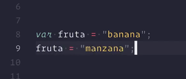
</div>

If we create a second variable _fruit2_ and we assign it the variable _fruit_, a copy of the _fruit_ value is created and it's going to be stored as the value for _fruit2_

<div align="center">
  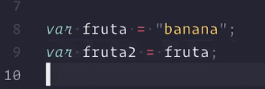
</div>

<div align="center">
  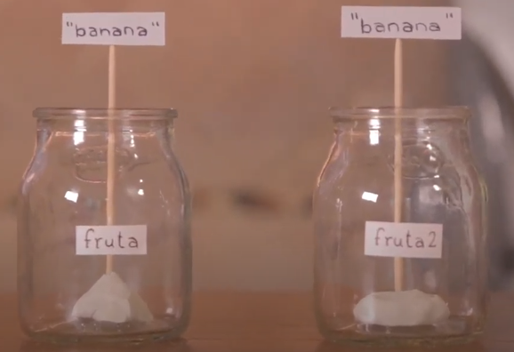
</div>

**_NOTE: If a variable contains a primitive value, when it is assigned to another variable, a copy of that value is going to be created fot that other variable, but there's any relationship between them. If you change the value of any, the other one remains with its current value. Variables in JavaScript are independent._**

Now, with objects something different happens. Primitives values are super basic, each one of them is simply the value they represent. Objects are more complex than promitive values, we can stored multiple values in them. To do that, we define its properties and assign a value for each one. And even after created, we can keep adding both properties and values, or delete one if we don't need it anymore.

<div align="center">
  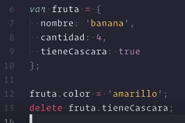
</div>

In this way, the objects do not occupy a fixed space in the memory of the computer like the primitive values, but their size can change. And the same thing happens with _arrays_, we can either add or remove elements from the array altering the size of memory the occupy.

There's a very important concept to remember ath this, point. **_The HEAP o dynamic memory is the are of the computer's memory designed to stored values._** This espace in memory is ever bigger than the space where primitive values are stored, but it is also slower to be accesed. Why? let's dive into it:

Each time an object is assigned to a variable, JavaScript is going to place that object in any space of memory it finds in the _heap_, and after that it's going to remember the memory address where it was put, and that value is what is stored in to the variable. This is what is known as **_reference_**, the memory position that is used to access to an object.

and what happens when I assign a variable to another variable that is pointing to an object? how is it made?

what's going to happen is that the reference to the object is going to be stored in both variables.

<div align="center">
  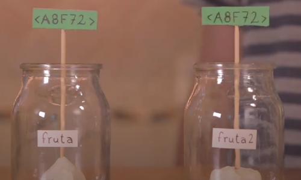
</div>

Each one of them is independent, so if we decide to assign a new object to any, its reference is now going to be diferrent in the computer's memory discarding the previous reference but, the other one is going to have its current value.

When there's no reference to an object, the JavaScript engine will know that it can remove that space in memory, leaving it free to be assigned to other objects.

**_NOTE: If we have multiple variables pointing to the same object, and we modify any property from that object using any of them that change is going to be reflected on the object which both of the variables are referencing to._**

<div align="center">
  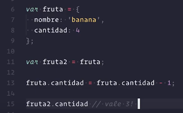
</div>

When we declare a function, we state the paremeters this is going to receive. So, if we declare a new variable and pass it to the previously defined function what's going to happen is that the value of that variable is going to be copied to the parameter, using the same logic we've already discussed.

<div align="center">
  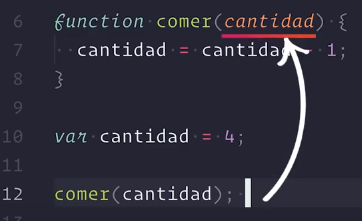
</div>

How can I pass a copy of the object and not a reference?

It all depends on what the object you are trying to copy is.

But basically, if the object you are trying to copy has only primitive values, you can do it in two ways:

1. _let copyPerson = Object.assign ({}, person);_ What it does is assign to a new empty object all the enumerable properties of the other object with their values. Obviously it creates a new object, a new reference, but its properties are the same.
2. _let anotherPerson = {... person};_ This does basically the same thing. With the spread operator, we are filling a new empty object with all the properties and values ​​of the person object.

This way of copying objects is called shallow copy (shallow copying).

Now what if the person object has more objects inside? As in this case:

```
let person = {name: 'Sacha', pets: ['Haru', 'Yuri'];
```

If we use any of the above methods, what will be copied is the array reference!

```
let personCopy = {... person};
copyPersona.mascotas.push ('Felix');
```

👆 This last line would be modifying the person pet array too!

If we know that the object we want to copy is like this, we are in trouble. Even worse if that object is very large. But do not despair, it has a solution.

One way would be to do:

```
let personCopy = JSON.parse (JSON.stringify (person));
```

In this way, we convert the object to string and then pass it from string to object. Creating a new reference. Just what we wanted.

But if the original object contains functions ... we are in trouble. Functions do not transform well to strings.

We have to do a deep copy in that case.

We can iterate all the properties and copy them recursively. That is, if we see that a property has a value that is an object, an array or a function (something that is not a primitive value) we should copy all those properties and values, checking the same for each of them.

The best solution in these cases would be to use an external library or package, with an already tested and documented solution, which we know works well.

1. One option would be to look for one that works for us in npm: https://www.npmjs.com/search?q=deep%20copy
2. Use lodash's deepClone method: https://lodash.com/docs/#cloneDeep

# Type Systems

Rules that a language imposed in order to classify what value types exists, how we can manipulate them, and what are the valid operations they support to be done between them.

## Type checking

Process of verifying and enforce the existing type restrictions for the language.

<div align="center">
  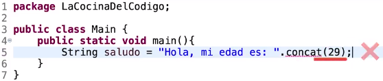
</div>

This type checking can occur before or during the execution of the program.

1. **Static type checking**: In compiled languages, the compiler takes our code and analyzes it in order to verify the type requirements from the language. It this verification turns out to be successful, the compiler can translate the program to a language that the computer can understand and execute. Otherwise, the executable program cannot be built, never ends up executing. Some of the languages with this type checking are: C#, Go, Java, Scala, Kotlin.

2. **Dynamic type checking**: The type ckecking is done at runtime execution. Interpreted languages like JavaScript, we deliver our code directly to another program that know who to read it and execute it (Any JavaScript Engine). Some of the languages with this type checking are: PHP, Ruby, Python. On this type of checking we cannot know what data type are our variables until the program is run and they start taking values.

## Type Requirement

How demanding is a language to consider that we are making type errors.

## Type Conversion

JavaScript allows making operations among values with different types with no problem, but to make that possible, it will take certain decisions for us:

<div aign="center">
  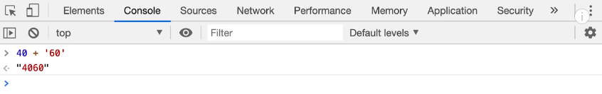
</div>

<div aign="center">
  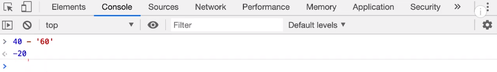
</div>

To avoid this, we can make a explicit type convertion to: string, number, boolean

<div aign="center">
  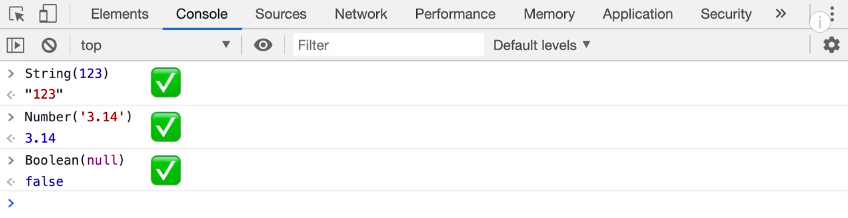
</div>

<div aign="center">
  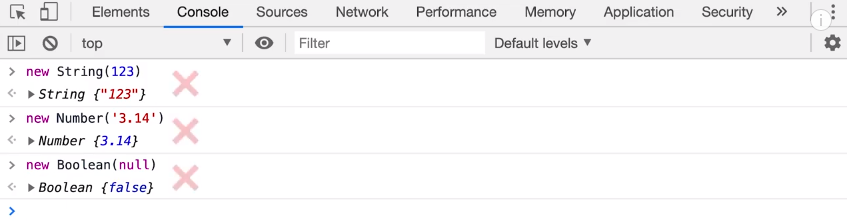
</div>

_**NOTE: We have to use them as functions, not as contructors. If we do so, we're going to be creating objects, not primitive values.**_

There are another ways of making explicit type convertions:

### To a string (if the value is neither null nor undefined):

```
2019 + "" = "2019"
true + "" = "true"
null + "" = "null"
(2019).toString() = "2019"

var valor = true
valor.toString() ---> "true"
```

### To a number:

```
+'1234' = 1234
+'3.14' = 3.14
+true = 1
+false = 0
```

_**NOTE: Either by implicit or explicit conversion, if a value is tried to be converted into a number and that operation cannot be resolved, we will obtain `NaN` as a result.**_

### To a boolean:

<div aign="center">
  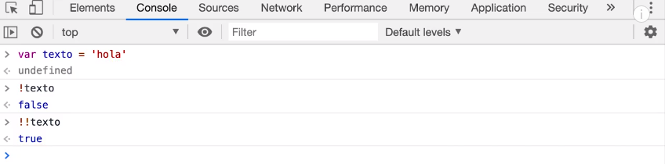
</div>

There are few exceptions:

<div aign="center">
  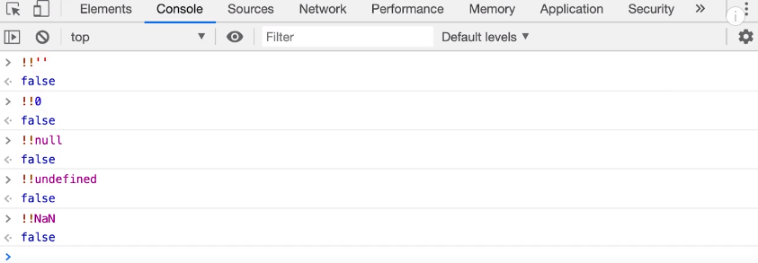
</div>

## Type Equivalence or Compatibility

How a language determines that a type is **compatible** with another type or **equivalent** to another type.

In Java, for instance, we can create to classes called 'Calculadora 1' y 'Calculadora 2' both of them with a unique method that does the same: it sums two integers. If after that we create a variable with type 'Calculadora 1' called 'calculadora' and we assing it a new instance of 'Calculadora 2', even though the internal structures of both classes are the same, we will have a type error on this language.

That's what is known as \***\*Nominal Type\*\***: Two types are compatible when they have the same name or when one is a subtype of the other (by inheritance).

With the languages having nominal typing programs are often created by writing multiple classes and using many object-oriented programming design patterns. Other languages sharing this typing are: Java, PHP, C#, C++, Swift.

Another type system is **Structural Type**: For two types to be compatible, **it is enough that they share the structure** that interests us.

<div aign="center">
  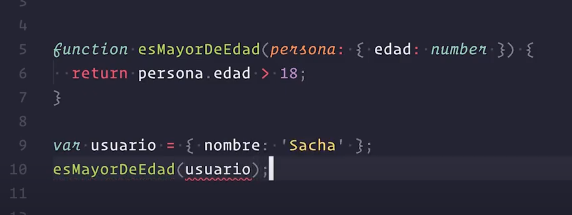
</div>

<div aign="center">
  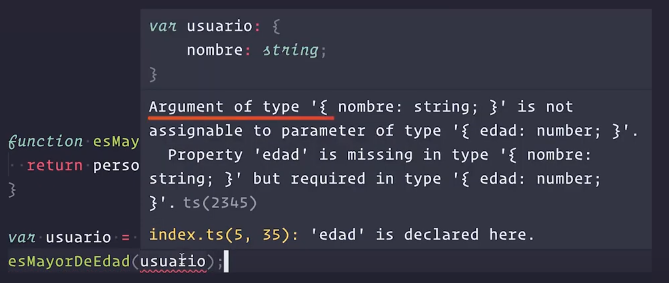
</div>

_**NOTE: Either the Nominal Typing or the Structural Typing are performed statically, that is, before the program is executed.**_

And what about the dynamic typing languages? how they determine that two types are compatible?

These type of languages use somthing called **_Duck Typing_** (o la prueba del pato): it's called like that because it comes from an old saying: If it walks like a duck, swims like a duck, and 'cuack' like a duck, I don't know if it's a duck but I can treat it like one. Taken to programming: **we don't care what type an object has**, as long as it has the attributes and methods we want to access.

Now, as we saw, the dynamic type checking is performed at runtime execution, so:

<div aign="center">
  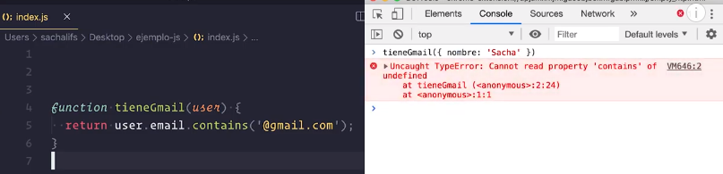
</div>

we're going to have an error type Error while the program is being executed.

<div aign="center">
  
</div>

## TypeScript

Is a typed superset of JavaScript that compiles to plain JavaScript, built and maintaned by Microsoft. It starts of **the same JavaScript syntax**, but adds **structural type checking** before our program executes.

# == vs ===

JavaScript has two ways of comparing values but, they work differently. Now, when should I use any and why?

### **When to use (strict equality operator) === :**

We check both type and value equality.

<div aign="center">
  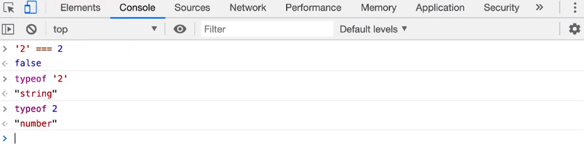
</div>

<div aign="center">
  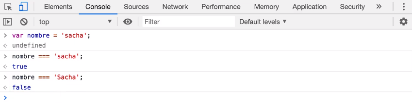
</div>

NOTE:

1. Strings are case sentitive, be careful with this.
2. Strict equality operator is also known as identity operator: When we use it to compare objects, this operator tell us wheter we are referencing to the same space in memory, or to the same object in memory.

### **When to use (loose equality operator) == :**

<div aign="center">
  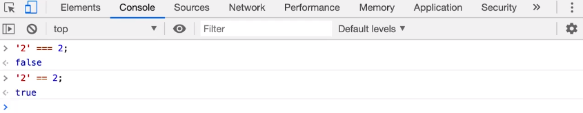
</div>

why does it happen? when we use this operator JavaScript internally uses what is called _type coercion_. So, results might not meet the expected output.

<div aign="center">
  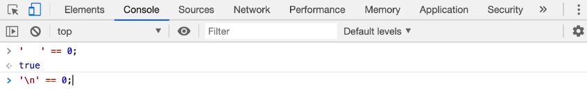
</div>

When it comes to objects or functions, why any of them is working?

<div aign="center">
  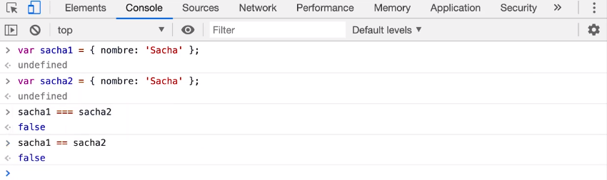
</div>

the reaons is that that type of resourse is more complex than a primitive value:

<div aign="center">
  
</div>

<div aign="center">
  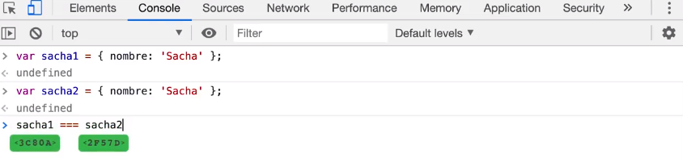
</div>

<div aign="center">
  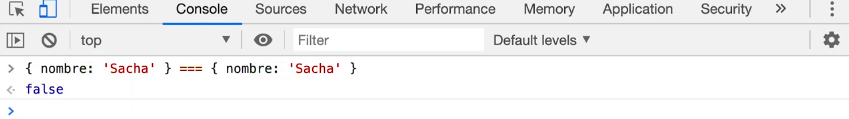
</div>

<div aign="center">
  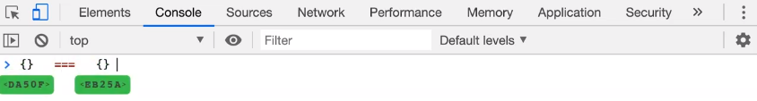
</div>

<div aign="center">
  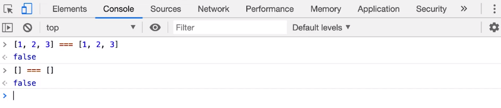
</div>

<div aign="center">
  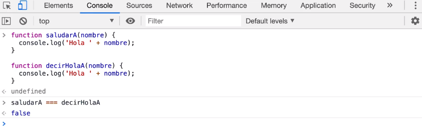
</div>

The only case for that operation to return TRUE is the both values are the same, which is the reference to a same space in memory:

<div aign="center">
  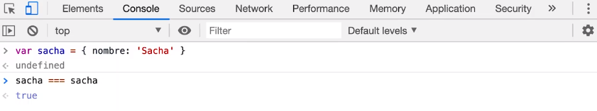
</div>

<div aign="center">
  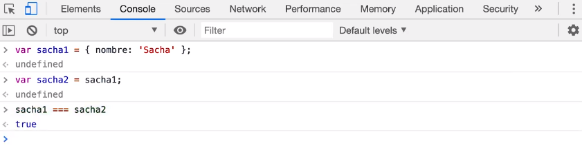
</div>

# Functions

<div align="center">
  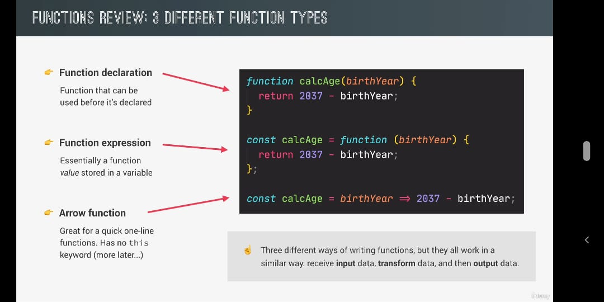
  <br/><br/>
  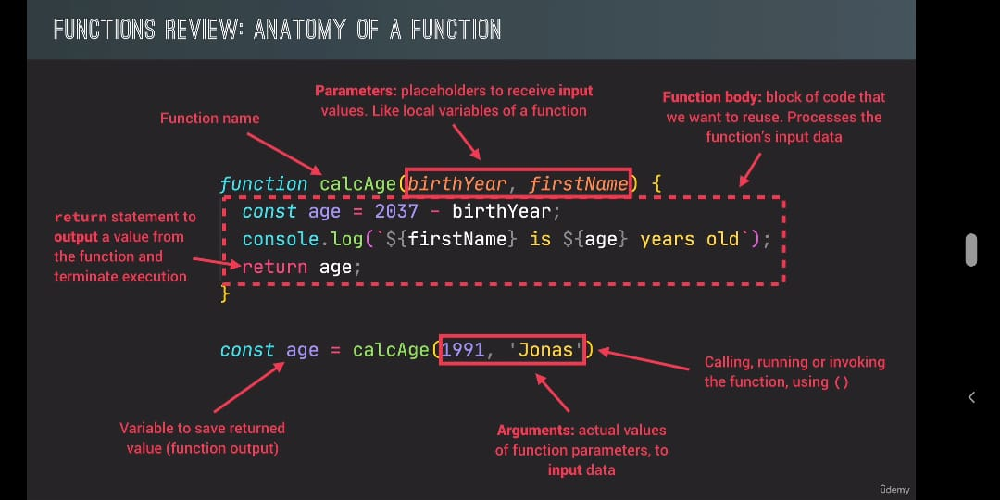
</div>

# JavaScript Engine and Runtime

- Engine: program that **executes** our code. Every browser has its own JavaScript engine, but probably the most well-known engine is Google's V8. V8 powers Google Chrome but also NodeJS, which is that JavaScript runtime.

  Every JavaScrit engine is composed by:

1. CallStack: is where our code is executed using something called execution context.
2. Heap: Unstructured memory tool which stores all the object that our application needs.

## Compilation VS Interpretation

- **Compilation**: The entire source code is converted into machine code at once, and written to a binary file that can be excecuted by a computer. So, we have two different steps here: first, the machine code is built and then it's executed in the CPU (in the processor).

- **Interpreted**: Interpreter runs through the source code and executes it line by line. The code is read and executed all the same time. Of course, the code needs to be converted into machine code but it simply happens right before it's executed. JavaScript used to be purely an interpreted language but the problem with it is that they're much slower than compiled ones.

Instead of simple interpretation, modern JavaScript engine know use a mix between compilation and interpretation, which is called _Just-In-Time (JIT) compilation_: this approach basically compiles the entire code into machine code at once, and the executes it right away.

## Modern JUST-IN-TIME compilation of JavaScript

As a piece of JavaScript code enters the engine, the first step is to _**parse**_ de code, which basically means to read the code. During the parsing process, the code is parsed into a data structure called "The Abstract Sintax Tree (AST)". This works by first splitting up each line of code into pieces that are meaningful to the language like the _const_ of _function_ keywords and then saving all these pieces into the tree in a structured way. This step also checks if there are any syntax errors and the resulting tree would later be used to generate the machine code.

Now, let's say we have a very simple program. All it does is to declare a variable and this is what the AST for that single line of code looks like

<div align="center">
  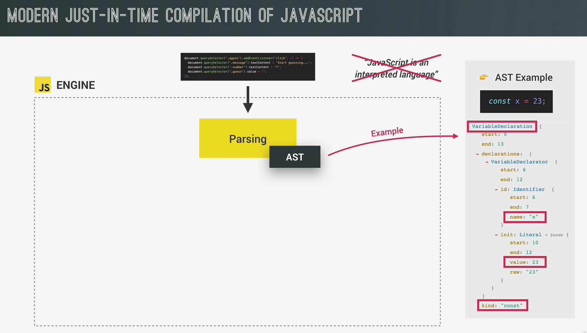
</div>

This tree has NOTHING to do with the DOM Tree.

The next step is _**compilation**_, which takes the generated AST and compiles it into machine code. This machine code then gets executed right away. Modern JavaScript Engines have some clever _optimization strategies_, what they do is to create a very un-optimized version of machine code in the beginning just so that it can start executing as fast as possible, then in the background, this code is optimized and re-compiled during the already running program execution. And this can be done multiple times, and after each optimization each un-optimized code is simply swaped for the new more optimized code without ever stoping execution, of course. This process is what makes the V8 Engine so fast.

<div align="center">
  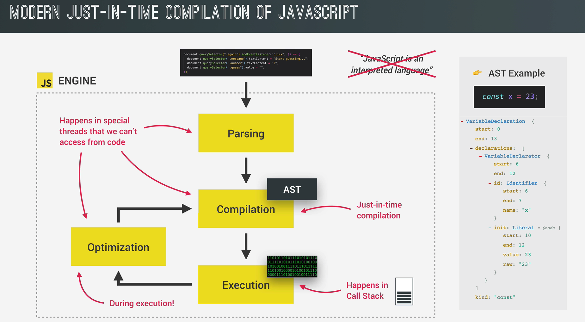
</div>

## JavaScript Runtime

We can imagine it as a big box or a big container which includes all the things that we need in order to use JavaScript in the browser. And the heart of every JavaScript runtime is always a JavaScript Engine. In order to work properly we also need access to the WEB API's (Functionalities provided to the engine which are not part if JavaScript itself, JavaScript simply get access to these API's through the globan _window_ object). A JavaScrit runtime also includes something called _Callback Queue_: this a data structure that contains all the callback functions that are ready to be executed.

<div align="center">
  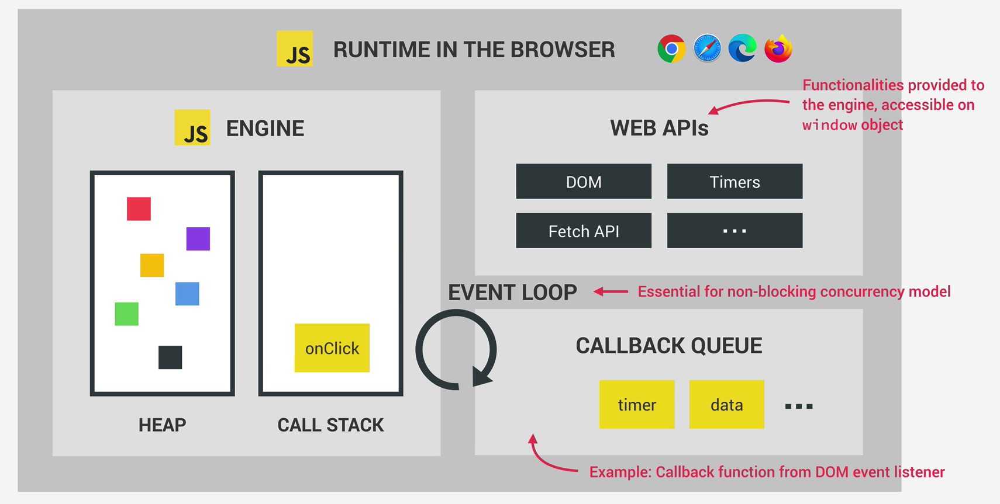
</div>

# Execution Contexts And The Call Stack

Let's suppose that our code was just finish compiling. The code is ready to be executed, what happens then is that a so called _**Global Execution Context**_ is created for the Top Level Code (Default context, created for code that is not inside any function)

<div align="center">
  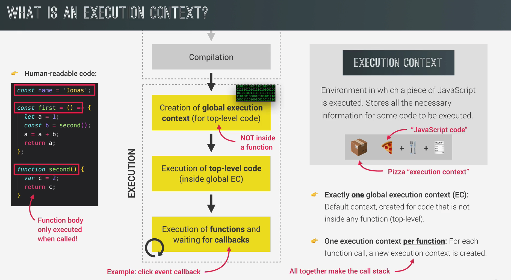
</div>

What exactly is an _execution context_? is an environment in which a piece of JavaScript is executed. Stores all the necessary information for some code to be executed. So, JavaScript code always runs inside an execution context.

Now that we have an environment in where the Top Level Code can be executed, it finally is executed. And once this code is executed is finished, functions finally starts to execcute as well, and here is how it works:

For each an every function call, a new execution context would be created containing all the information that is necessary to run exactly that function. All these execution contexts together make up the Call Stack. When all functions are done executing, the engine will basically keep waiting for callback functions to arrive so it can execute these, for instance, a callback function associated to a click event; And remember that is the Event Loop which these new callbacks.

## Execution Context In Detail

The first thing that's inside any execution context is a so called variable environment. In this environment all variables and function declarations are stored and there's also a special argument's object. This object contains all the arguments that were passed into the function that the current execution context belongs to. However, the function can access variables outside of the function, this is possible because of the _**Scope Chain**_ (it consists of references to variables that are located outside of the current function) and to keep track of this scope chain, it is stored in each execution context. Finally, each context also gets a special variable called the _**this**_ keyword. Now, the content of the execution context (Variable Environment, Scope Chain and _this_ keyword) is generated during the _**Creation Phase**_ which happens right before execution.

One final, but very important detail that we need to keep in mind, is that execution contexts belonging to arrow functions do not get their own arguments keyword nor do they get the _this keyword_. So, basically arrow functions can use the arguments object and the _this_ keyword from their closest, regular function parent.

<div align="center">
  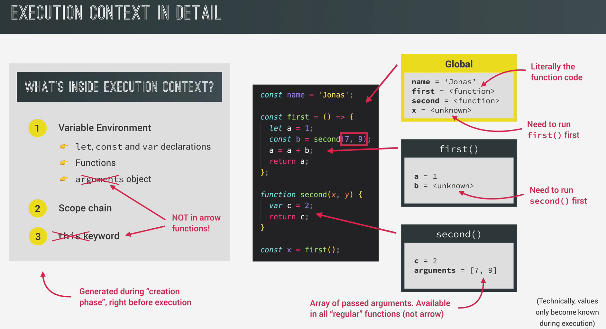
</div>

Now, how will the engine keep track of the orderin which functions were called and how will it know where it currently is in the execution? That's where the Call Stack comes in. Remember that the call stask together with the memory heap makes up the JavaScript Engine itself. But what exactly is the Call Stack? it's basically a "place" where execution contexts get stacked on top of each other, to keep track of where we are in the execution.

<div align="center">
  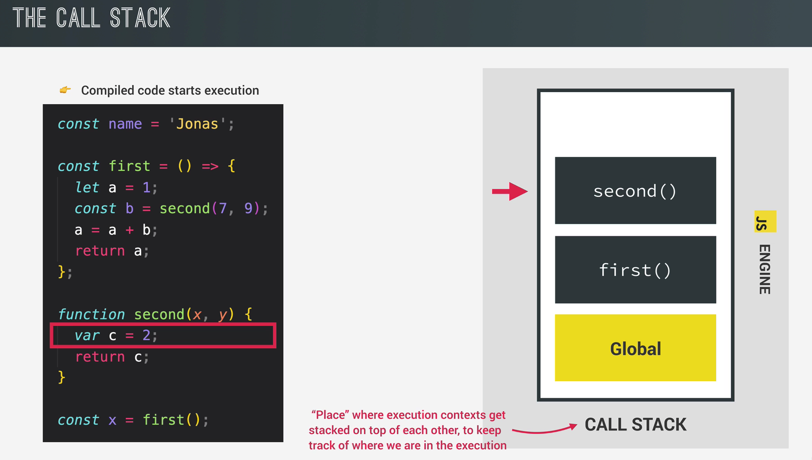
</div>
<br/>

# Scoping and Scope In JavaScript

_**Scoping**_: How our program's variables are **organized** and **accessed**. "Where do variables live?" or "Where can we access a certain variable, and where not?"

_**Lexical Scoping**_: Scoping is controlled by **placement** of functions and blocks in the code. For example, a function that is written inside another function has access to the variables of the parent's function.

_**Scope**_: Space or environment in which a certain variable is **declared** _(variable environment in case of functions)._ There is a **global** scope, **function** scope, and **block** scope.

- _**Scope of a variable**_: Region of our cocde where a certain variable can be **accessed**.
  <br/>

## The 3 Types Of Scope

<div align="center">
  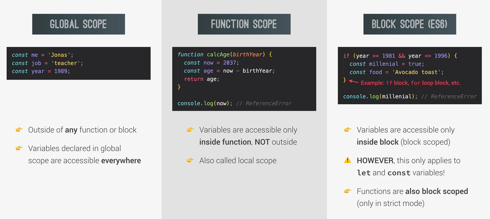
</div>

<br/>

<div align="center">
  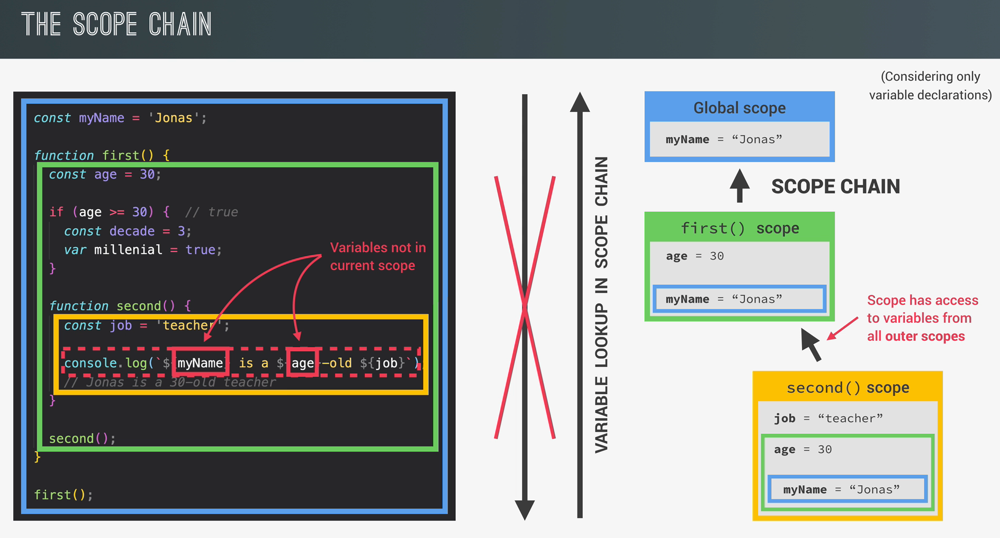
  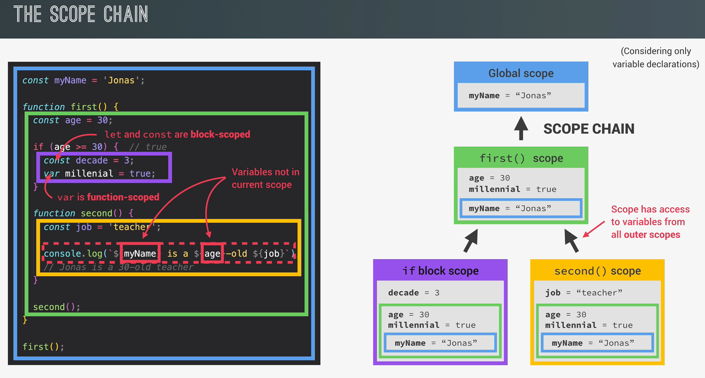
  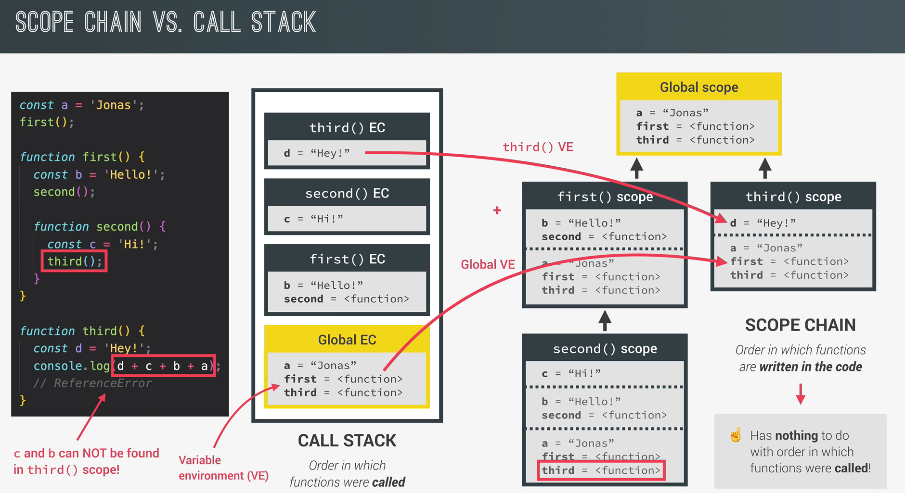
</div>
<br />

# Hoisting and Temporal Dead Zone

- _**Hoisting**_: Makes some types of variables accesible/usable in the code before they are actually declared. "Variables lifted to the top of their scope".

This takes place during the _creation phase_ of the execution context, and basically what happens behind the scenes is that, before execution, code is scanned for variable declarations, and for each variable, a new property is created in the **variable environment object**

Hoisting does not work the same for all variable types

<div align="center">
  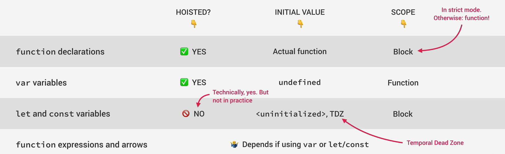
</div>
<br />

# How the `this` keyword works

Special variable that is created for every execution context (every function). Takes the value of (points to) the "owner" of the function in which the _this_ keyord is used. What's very important to understand is that the value of _this_ is **NOT** static. It depends on **how** the function is called, and its value is only assigned when the functions **is actually called.**

Let's analyze 4 different ways in which functions can be called:

1. **Method (As a function attached to an object) -> _`this` = Object that is calling (not defining) the method_**: When we call a method, the _this_ keyword inside that method would simply point to the object on which the method is called (in other words, it points to the object that is calling the method).

<div align="center">
  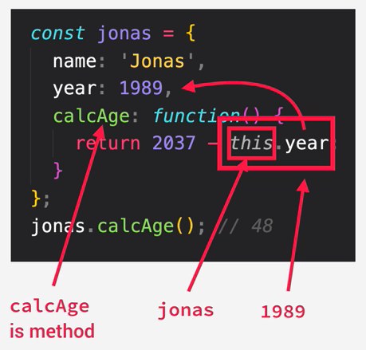
</div>
<br />

2. **Simply function call -> `this` = undefined:** This is only valid for _strict mode_. So, if you're not in strict mode _this_ would actually point to the global object which in case of the browser is the window object.

3. **Arrow functions -> this = _this_ of surrounding function (lexical `this`):** While they are not exactly a way of calling functions it's an important one that we need to consider. Remember: they do not get their own `this` keyword. Instead, if you use the `this` variable in an arrow function it would simply be the `this` keyword of the surrounding function (of the parent function). And in technical terms , this is called: The lexical keyword, because it simply get picked up from the outter lexical scope of the arrow function.

4. Event listener -> `this` = DOM element that the handler function is attached to.

5. Using the keywords _new, call, apply, bind_.

What the `this` keyword is not: `this` would never point to the function itself, and also **NOT** point to the variable environment of the function.

# Regular Functions VS Arrow Functions

Pitfalls of the `this` keyword related to regular functions and arrow functions:

```JavaScript
1st Pitfall

const victor = {
  firstName: 'Victor',
  year: 1991,
  calcAge: functions () {
    console.log(this);
    console.log(2037 - this.year);
  },
  greet: () => console.log(`Hey ${this.firstName}`);
};

jonas.greet() // Will output 'Hey undefined' since the arrow functions don't get their own `this` keyword. They would simply use the `this` keyword from their surroundings. In other words, their parent's `this` keyword (Global Scope in this case, and this.firstName is also undefined)
```

```JavaScript
2nd Pitfall (When we have a `function` inside of a method)

const victor = {
  firstName: 'Victor',
  year: 1991,
  calcAge: functions () {
    console.log(this);
    console.log(2037 - this.year);

    // Solution One
    // const self = this; // To avoid the error we can do this.
    // const isMillenial = function () {
    //   console.log(self.year >= 1981 && self.year <= 1996)
    //   //console.log(this.year >= 1981 && this.year <= 1996)
    // }

    // Solution Two -> The arrow function inherits the `this` keyword from the parent scope.
    const isMillenial = () => {
      console.log(self.year >= 1981 && self.year <= 1996)
      //console.log(this.year >= 1981 && this.year <= 1996)
    }
    isMillenial(); // As it is a function call the `this` keyword is undefined.
  },
  greet: () => console.log(`Hey ${this.firstName}`);
};
jonas.greet()
jonas.calcAge()
```

# Primitive vs Reference Value

<div align="center">
  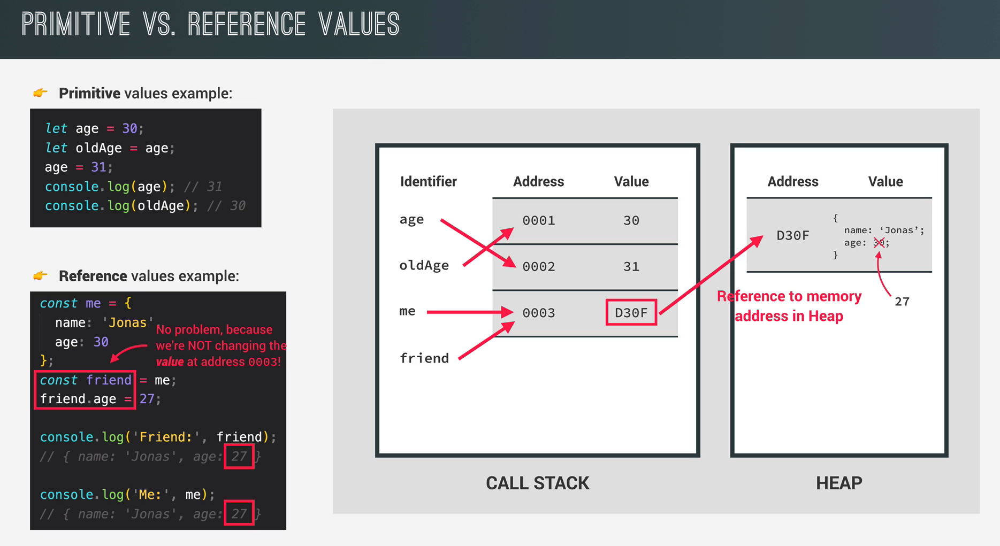
</div>
<br />

# First-Class and Higer-Order Functions

<div align="center">
  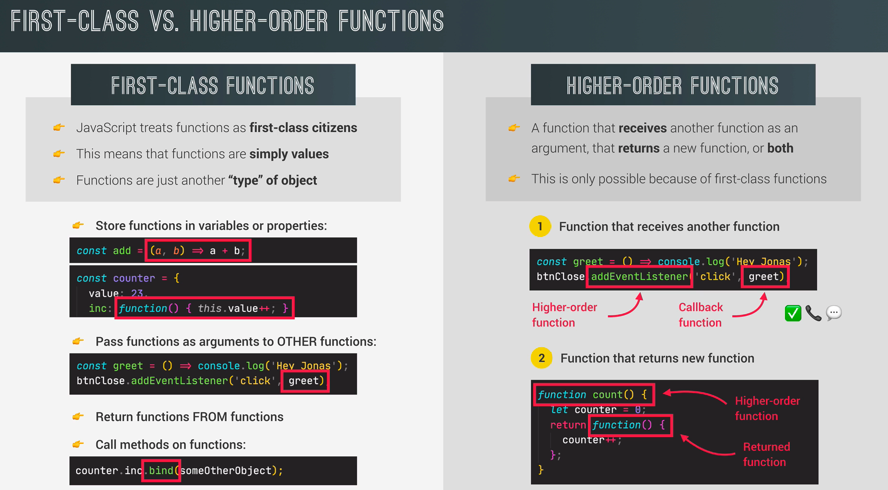
</div>
<br />

Some people think they're the same thing, but they mean different things:

1. First-Class Functions is just a feature that a programming language either has or does not have, all it means is that all functions are values, that's it. There are not first-class functions in practice, it's just a concept.
2. There are, however, higher-order functions in practice which are posible because the language supports first-class functions.

# Closures

I'll start by defining a new function called `secureBooking` and is this function that would create the `closure`. Now, the first thing that I have to tell you about the `closures` is that they're not a feature that we explicitly use so, we don't create them manually like we create a new array or a new function. A closure simply happens automatically in certains situations, we just need to recognize them.

```JavaScript
  const secureBooking = function() {
    let passengerCount = 0;

    return function() {
      passengerCount++;
      console.log(`${passengerCount} passengers`);
    }
  }

  const booker = secureBooking();

  booker();
  booker();
  booker();
```

<div align="center">
  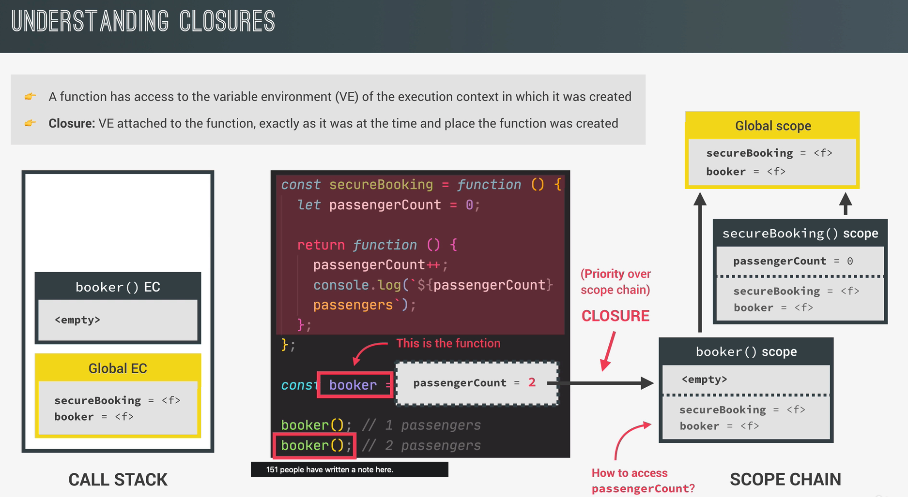
</div>
<br />

<div align="center">
  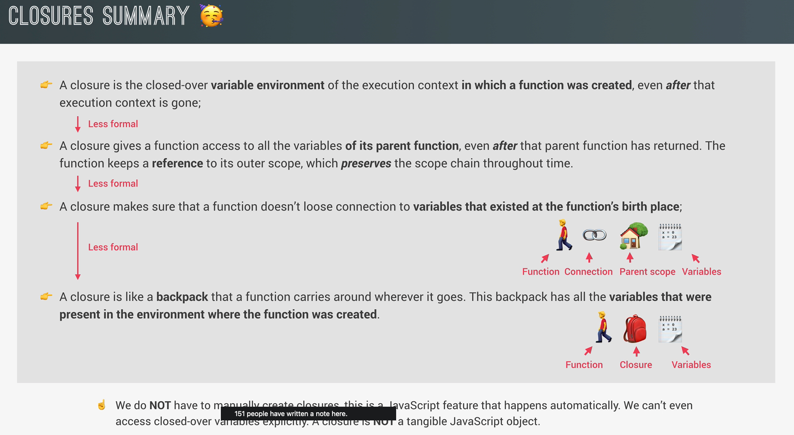
</div>
<br />

# Data Transformations map, filter, reduce

<div align="center">
  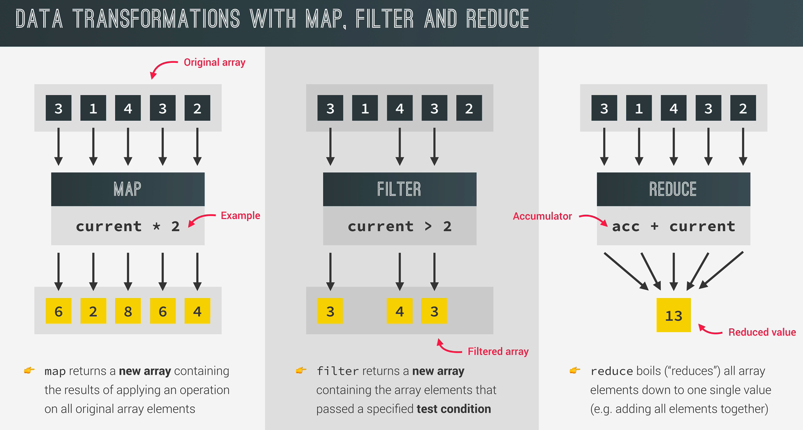
</div>
<br />

# Working with arrays

<div>
  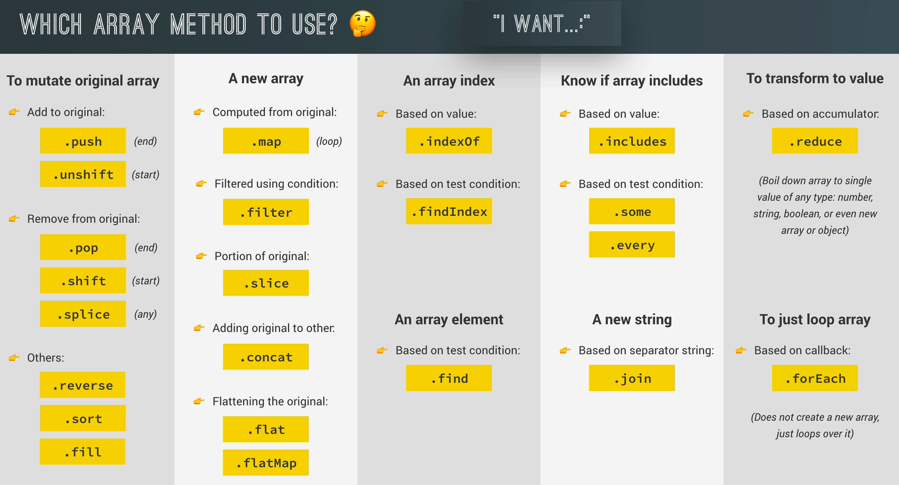
</div>

# What is Object Oriented Programming

OOP, in short, is a programming paradigm (style of code, "how" we write and organize the code) based on the concept of objects.

We use objects to **model** (describe) real-world (user or TO-DO list item) or abstract features (HTML component or data structure).

Objects may contain data (properties) and code (methods). By using objects, we pack **data and the corresponding behaviour** into one block.

<div align="center">
  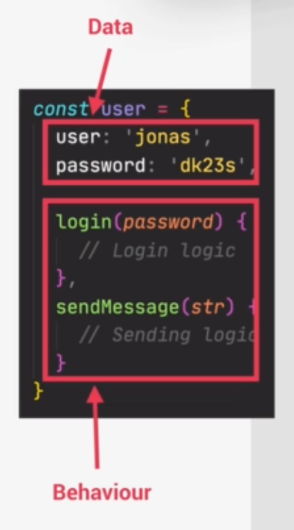
</div>
<br />

In OOP, objects are **self-contained** pieces/blocks of code.

Objects are **building blocks** of applications, and **interact** with one another.

Interactions happen througha **public interface** (API): methods that the code **outside** of the object can access and use to communicate with the object.

OOP was developed with the goal of **organizing** code,to make it **more flexible and easier to maintain** (avoid "spaghetti code").

# Classes and instances

In OOP we actually need a way to create new objects from our code and to do that, in traditional OOP, we use something called **classes**. Yoy can think of a class as a blueprint from which we can create new objects based on the rules described in the class. We call all objects created through a class **instances of that class**, they're real objects we can use in our code which were created from a class and the class itself is not an object.

<div align="center">
  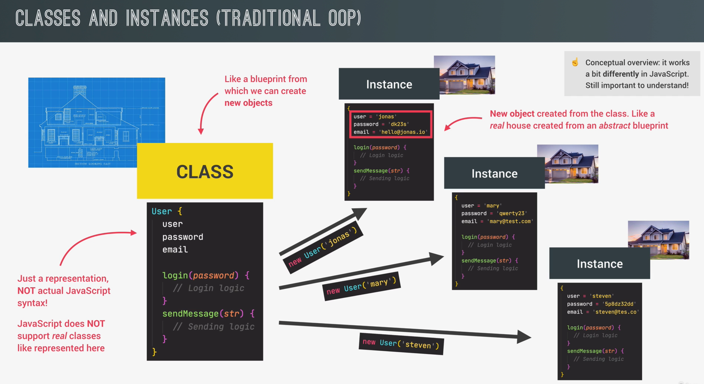
</div>
<br />

# The 4 fundamental OOP principles

How do we actually design classes? How do we model real-world data into classes?

1. **Abstraction**: Ignores or hides details that **don't matter**, allowing us to get an **overview** perspective of the _thing_ we're implementing, instead of messing with details that don't really matter to our implementation.

<div align="center">
  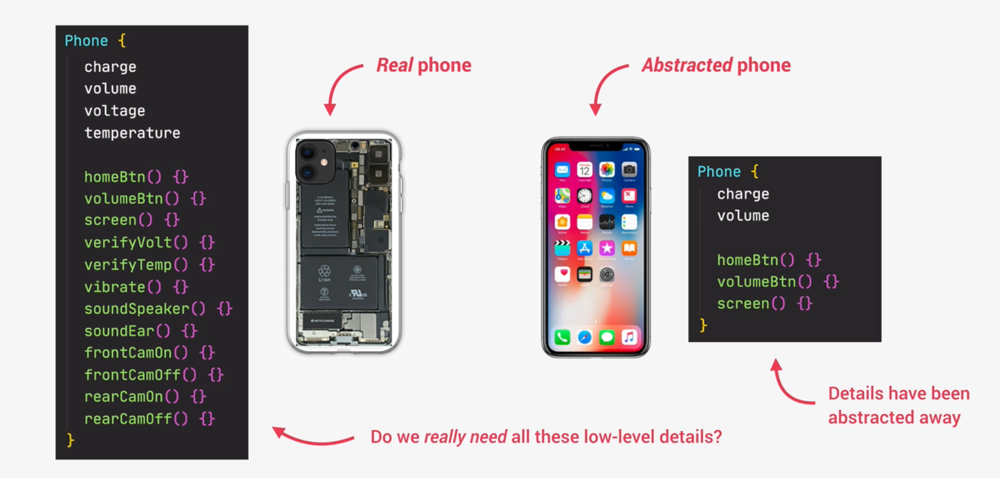
</div>
<br />

Abstraction is very important in programming in general. In fact, we create and use abstraction all the time. For example, take de _window.addEventListener_ method that we use all the time, do we actually know how exactly it works behind the scenes? Well, we don't. And, do we care? No, not really, and we don't have to because, once more, the low-level details about how exactly it works has been extracted away from us. We are simply the user, so we can simply use that function without completely understanding it and without having to implement it ourselves. So, that's _abstraction_ that actually blends in with the next principle which is

2. **Encapsulation**: Keeps properties and methods **private** inside the class, so they are **not accessiblble from outside the class**. Some methods can be **exposed** as a public interface (API). By having this critical properties nicely encapsulated like this we prevent external code from accidentally manipulating internal properties/state (object data). This is really important, because allowing external code to manipulate internal state directly can cause many kinds of bugs, specially in large code bases at developer teams.

Now, as you see, there's also a privata method here, again it's not accessible from outside the class but, it's used internally. So, we want no one else outside of the class to be able to use this method (we don't basically make it part of the public interface). The public interface is essentially all the methods that are not _private (that are not encapsulated)_. Making methods _private_ makes it easier for us to change our code without breaking code from the outside which might rely on some of these methods.

<div align="center">
  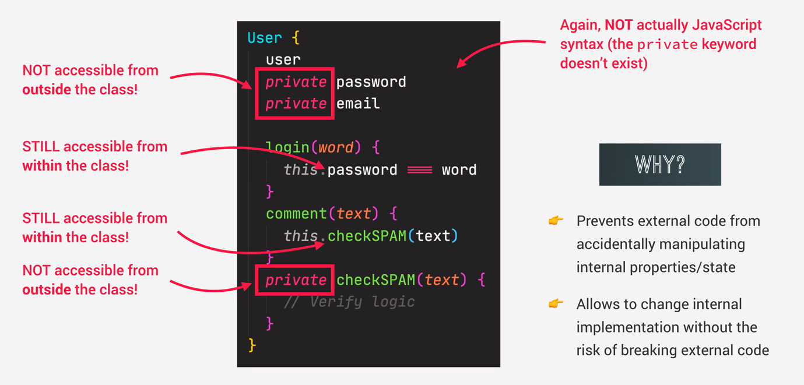
</div>
<br />

3. **Inheritance**:

Let's say que have these two classes, _user_ and _admin_, and as we can see they have actually a lot in common. In fact, _admin_, has all the properties and methods that user has, and that makes sense because if you think about it and _admin_ is also a _user_ so, an _admin_ also nees a password, and email, and also needs to log in, for example. However, if we design our classes like this, as two separate entities we'll end up with a lot of duplicate code, and we know that that's bad. But well, that when _inheritance_ comes into play. So, in OOP, when we have two classes that are closely , like _user_ and _admin_ here, we can one class inherit from another, so we would have a _parent class_ and a _child class_, having the child class exteding the parent class. What all of this mean? well, basically a child class inherits all the properties and methods from its parent class. In more formal terms: **_Inheritance_** makes all properties and methods of a certain class **available to a child class**, forming a hierarchical relationship between classes. This allows us to **reuse commom logic** and to model real-world relationships.

<div align="center">
  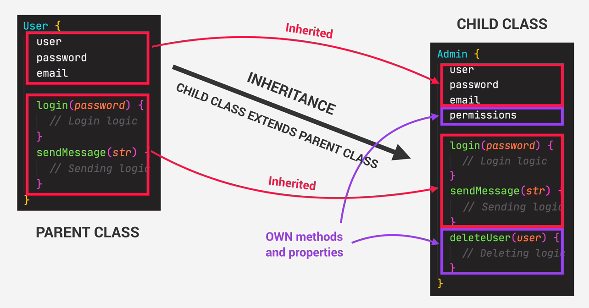
</div>
<br />

4. **Polymorphism**: It sounds a bit weird, which is because it comes from greek where it literally means _many shapes_. Now, in the context of OOP, it means that a child class can **overwrite** a method it inherited from a parent class (it's more complex than that, but enough for our purposes)

<div align="center">
  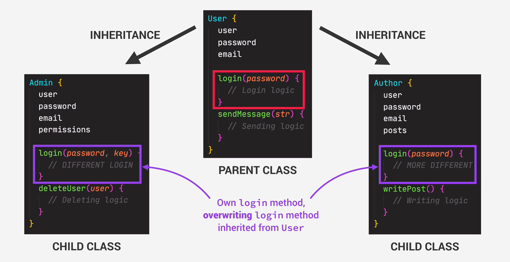
</div>
<br />

# How does OOP actually works in JavaScript

We have something called **_prototypes_**, and all objects are **linked** to a prototype object. So, we say that each object has a prototype.

And now here, comes the magic: the prototype object contains methods and properties that all the objects that are linked to that prototype can access and use, and this behaviour is usually called **_prototypal inheritance_**. Basically, objects inherit methods and properties from the prototype which is the reason this mechanism is called _prototypal inheritance_, just note that this inheritance is different from the inheritance we talked about in a previous step, that was one class inherinting from another class. But, in this case, it's basically an instance inheriting from a class. We can also say that objects delegate behaviour to the linked prototype object, and behaviour is just another term for methods.

So, besides **_prototypal inheritance_** we also call this mechanism **_delegation_**. And that's also the reason why this arrow is pointing upwards because technically objects delegate their behaviour to the prototype.

On the other hands, in clasical OOP with classes, the behaviour (the methods) are copied from the class to the objects and so, that's completely different.

How do we implement OOP in JavaScript in practice?

1. Constructor Functions:

```Text
- Technique to create objects from a functions, which will also set the new object prototype.
- This is how 'built-in' objects like Arrays, Maps or Sets are actually implemented. Actually, this is how OOP has been done in JavaScript basically since the beginning.
```

2. ES6 Classes:

```Text
- Modern alternative to constructor function syntax.
- 'Syntactic sugar': behind the scenes, ES6 classes work exactly like constructor functions.
- ES6 classes do NOT behave like classes in 'classical OOP'
```

3. Object.create()

```Text
- The easiest and most straightforward way of linking an object to a ptototype object.
```

<div align="center">
  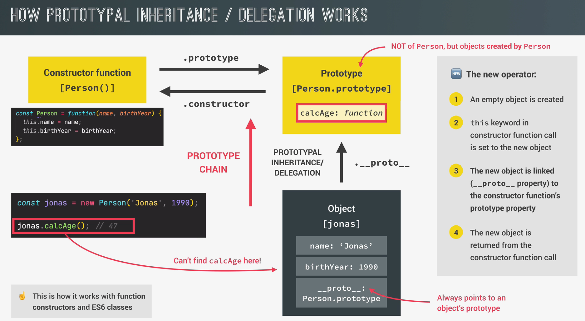
</div>
<br />

<div align="center">
  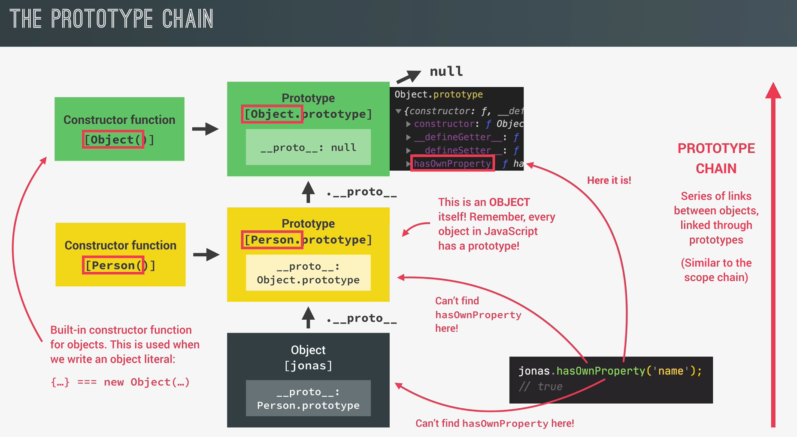
</div>
<br />
